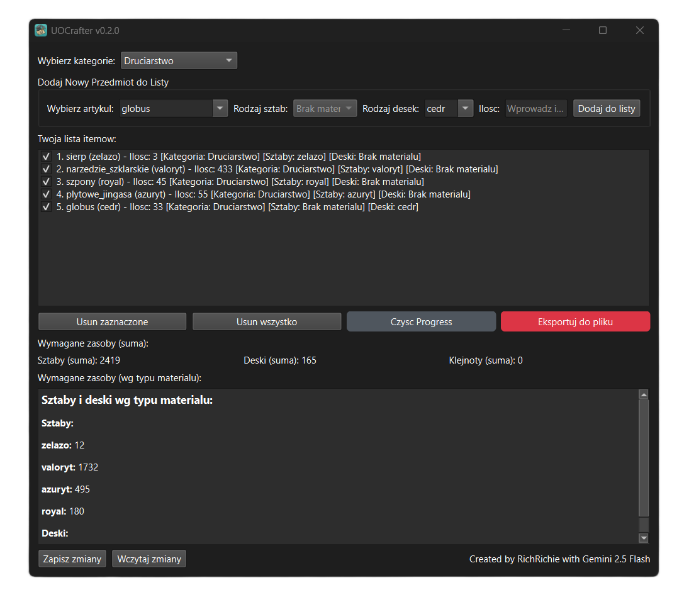

# 🛠️ UOCrafter


**UOCrafter** is a graphical application that helps manage and create crafting order lists to be used in Razor Enhanced on MW-Shard. Built with Python and PyQt6.

---

## ✨ Features

- Dynamic item/category selection
- Calculates required resources (ingots, boards, gems)
- Exports shopping list to `.txt` file will be used in Razor Enhanced script

---

## 🚀 Windows run instructions (Python)

You need to download Python 3.x from offisial website: [Install now](https://www.python.org/downloads/release/python-3135/)

Do this terminal:
1. Install required lib PyQt6 :
   ```bash
   pip install PyQt6
   ```

2. Run app:
   ```bash
   python UOCrafter.py
   ```

## 🚀 Windows run instructions (exe)

You can also download latest EXE release from GitHub.
> *Warrning! Windows will think its a virus but let it run its OK* 🤪 


## 📄 License

This project is licensed under the MIT License.  
Feel free to use, modify, and share.

---

## 👤 Author

**RichRichie**  
Built with support from `ChatGPT + Gemini 2.5 Flash`

---



